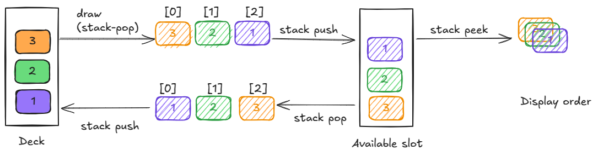
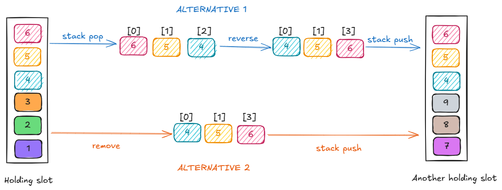

# Solitaire Design Notes

A stack of cards seems to be the lowest common denominator. Let me list down the attributes of different types of decks -

* Deck - a stack of all face-down cards randomly ordered.

  * ~~It cannot be pushed onto~~ When it is empty and there are available cards, the deck can be rebuilt with available cards.
  * A stack of available cards are drawn at a time from the top. This can be either 1 card or 3 cards.

* ~~Available - a stack of either 1 or 3 cards most recently drawn from the deck.~~

* AvailableSlot - a stack of all face up cards.
  * ~~It cannot be pushed onto~~
  * Cards drawn from the deck are pushed onto this slot.
  * Only one card at a time can be drawn
  * Only the top-3 cards are visible

* SuitSlot  - a stack of all face-up cards belonging to the same suit in ascending order. There can be only 4 such slots.

  * A single card can be pushed or popped.
  * Only the top card is visible.

* HoldingSlot - a stack of cards with the bottom ones being face-down and the top ones being face up, of alternating color, and in descending order. There can only be 7 such slots.

  * It is possible to pop a substack from the top of all open cards.

  * It is possible to push a substack to the top of all open cards.

  * It is possible to push a single card onto the top.

  * It is possible to pop a single card onto the top.
  
  * All open cards are visible.

So how does the game loop work? Before the game starts -

1. Initialize a full deck
2. Setup a bunch of empty suit and holding slots
3. Deal from the deck to fill the holding slots.

Game begins - user turn -

User can take any one of the following actions -

* Draw cards from the deck onto the available slot (no rollback required)

```c++
auto cards = deck.draw();
available_slot.push(cards);
```


* Pop the top card from the available slot

  * Push it onto any of the suit slots

  ```c++
  auto card = available_slot.pop().value();
  suit_slot.push(card);
  ```

  * Push it onto any of the holding slots

  ```c++
  auto card = available_slot.pop().value();
  holding_slot.push_one(card);
  ```

  

* Pop the top card from the suit slot

  * Push it onto any of the holding slots

  ```c++
  auto card = suit_slot.pop().value();
  holding_slot.push_one(card);
  ```

  

* Pop the top card from any of the holding slots

  * Push this card onto the suit slot

    ```c++
    auto card = holding_slot.pop_one().value();
    suit_slot.push(card);
    ```

  * Push this card onto any of the holding slots

    ```c++
    auto card = holding_slot.pop_one().value();
    holding_slot.push_one(card);
    ```

  

* Pop the top few cards from the any of the holding slots

  * Push them onto any of the other holding slots

  ```c++
  auto cards = holding_slot.pop_some(starting_card);
  holding_slot.push_some(cards);
  ```


* Reset the deck when it is empty

  ```c++
  auto cards = available_slot.pop_all();
  deck.reset(cards);
  ```

  

Based on the user input, I can start the move in a frame. Then eventually in one of the later frames, the user input will indicate the end of the move, if it is a valid end, the move is committed, otherwise rolled back. I can model the rollback by having an `undo` API on all the relevant slots. The moves all start with a pop op, and most of the slots have a corresponding push op that I can use, except available slot, which does not have an op to push a single card on top. My gut feel is that it will be easier from the game object to just `undo` the op and the slots can remember the last push that they made.

For the most part I am popping/pushing one card at a time so it is very clear what needs to happen. However there are three scenarios where I am moving multiple cards at once -

1. Drawing cards from deck to the available slot
2. Moving all the cards from the available slot to the deck to reset it
3. Moving cards from one holding slot to another holding slot

Here is a visualization of the first two scenarios -



There are two alternatives for the third scenario -



Even though alternative 2 is more efficient, I like alternative 1 because the interfaces are consistent. I think I'll go with that. 

What data structure should I use for the data contract? I can use a vector as all the in-transit cards need to be ordered. The only place where I'll need to represent the in-transit card is in the third scenario where the user is moving it. For the first and second scenario the user will simply initiate the action, they will not hold-and-move the in-transit cards, so I could even avoid having in-transit cards with an API like -

```c++
void Deck::reset(AvailalbeSlot slot) {
  _cards.push(slot.pop());
}

void Deck::draw(AvailableSlot slot) {
  slot.push(_cards.pop());
}
```

And I can use vectors or some sort of an ordered iterator to represent the in-transit muti-cards. It does not have to be sequence of known length as I can just iterate through all the cards when adding or removing. Though adding/removing one card at a time when eventually I'll need to cut-and-paste the cards in the exact same order does sound wasteful. 

Here are the built-in C++ data structures I have to choose from -

| Data Structure                                        | Implementation Notes                                         |
| ----------------------------------------------------- | ------------------------------------------------------------ |
| vector: dynamic contiguous array                      | Random access: O(1)<br />Insertion/removal at the end: amortized O(1)<br />Insertion/removal: O(n)<br />Resizing can be expensive. |
| deque: double-ended queue with non-contiguous storage | Random access: O(1)<br />Insertion/removal at either end: O(1)<br />Insertion/removal: O(n)<br />Resizing is cheaper than vectors, but the minimal memory cost can be large, e.g., a single element queue will take up more memory than a single element vector. |
| forward_list: singly-linked list                      | Random access: O(n)<br />Insertion/removal anywhere: O(1)<br />Takes less space than doubly linked lists.<br />Does not have a built-in way of getting the length. |
| list: doubly-linked list                              | Random access: O(n)<br />Insertion/removal anywhere: O(1)<br />Does support getting the length. |

C++ also has this concept of a container adaptor that provides additional abstraction on the underlying container. It has a stack adaptor that uses a default underlying container of deque but I can change it to any other container. This seems like a good choice given all my containers are stacks.

For the deck, available slot, and suit slots I can use a stack. Holding slot will be a bit more involved because there will be two stacks to maintain, the stack of open cards and stack of closed cards. Closed cards can be modeled as a stack because I'll only ever pop a single card from it. And the only time I'll push cards onto it is when I am dealing at the beginning of the game. Open cards can be modeled as a deque or a list. Even though deque has fast random access, it won't help in this scenario. The game will have the reference to the starting card, not its index in the slot. So I'll have to do a serial search to find the card anyway. With list I still have the constant time removal from the source slot and insertion in the destination slot.

Possible object model -

```c++
class AvailableSlot {
public:
  Card& pop();
  void push(Card& card);
private :
  stack<Card> _cards;
};

class Deck {
public:
  void deal(HoldingSlot slot);
  void draw(AvailableSlot slot);
  void reset(AvailableSlot slot);
  size_t len;
private:
  stack<Card> _cards;
};

class SuitSlot {
public:
  void push(Card& card);
  Card& pop();
  bool is_complete();
	size_t len;
private:
  stack<Card> _cards;
};

class HoldingSlot {
public:
  Card& pop();
  Cards pop_block(Card& start);
  void push(Card& card);
  void push_block(Cards card);
private:
  stack<Card> _closed_cards;
  list<Card> _open_cards;
};
```

